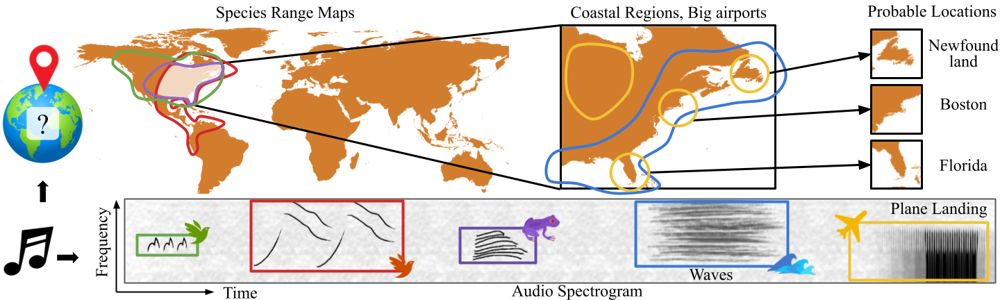

# Audio Geolocation: A Natural Sounds Benchmark

<p align="center">
  
  <br>
  <em>Figure 1: Intuition for Audio Geolocation</em>
</p>

Can we determine someone’s geographic location purely from the sounds they hear? Are acoustic signals enough to localize within a country, state, or even city? We tackle the challenge of global-scale audio geolocation, formalize the problem, and conduct an in-depth analysis with wildlife audio from the iNatSounds dataset. Adopting a vision-inspired approach, we convert audio recordings to spectrograms and benchmark existing image geolocation techniques. We hypothesize that species vocalizations offer strong geolocation cues due to their defined geographic ranges and propose an approach that integrates species range prediction with retrieval-based geolocation. To enable richer analysis, we construct XCDC, an evaluation dataset of dawn chorus recordings that are longer in duration and contain multiple species vocalization. Finally, we present case studies using audio and images from movies, demonstrating potential downstream applications of multimodal geolocation. Our work highlights the advantages of integrating audio and visual cues, and sets the stage for future research in audio geolocation.

## Dataset Setup 

Download [iNatSounds](https://github.com/visipedia/inat_sounds/tree/main/2024) and [XCDC](). 

Extract spectrograms from raw waveforms using [get_spectrograms](./setup/get_spectrograms.py). 

~~~
python3 setup/get_spectrograms.py \
    --root_dir <> \
    --np_dir <> \
    --vis_dir <>
~~~

Make retrieval galleries.
~~~
python3 setup/make_galleries.py
~~~


## Instructions to Reproduce Experiments

Set the variables in [config](./src/config.py) to appropriate paths after setting up the dataset. 

### Regression

~~~
python3 main.py \
    --encoder_weight $INAT_CLS_WEIGHT \
    --task_type lat_lon --loss mse

python3 main.py \
    --encoder_weight $INAT_CLS_WEIGHT \
    --task_type lat_lon --loss haversine
~~~


### Classification

~~~
python3 main.py \
    --encoder_weight $INAT_CLS_WEIGHT \
    --task_type classification --geo_resolution 0
~~~

### Hierarchical Classification

Please run normal classification experiment with geo_resolution 0, 1 and 2. Replace paths of these models in [Models lines 64-82](./src/models.py).


~~~
python3 main.py \
    --task_type classification --geo_resolution 0 \
    --model hierarchical --mode eval
~~~


### AG-CLIP


~~~
python3 main.py \
    --encoder_weight $INAT_CLS_WEIGHT \
    --task_type audio_geoclip
~~~


### AG-CLIP location encoder ablations

~~~
python3 main.py \
    --encoder_weight $INAT_CLS_WEIGHT \
    --task_type generalclip --loc_emb geoclip

python3 main.py \
    --encoder_weight $INAT_CLS_WEIGHT \
    --task_type generalclip --loc_emb satclip

python3 main.py \
    --encoder_weight $INAT_CLS_WEIGHT \
    --task_type generalclip --loc_emb sinr
~~~


## Citation

If you use the dataset and benchmark in your work, please consider citing us:


```
@inproceedings{audio_geo,
    author = {Chasmai, Mustafa and Liu, Wuao and Maji, Subhransu and Van Horn, Grant},
    booktitle = {arxiv},
    title = {Audio Geolocation: A Natural Sounds Benchmark},
    year = {2025}
}
```
